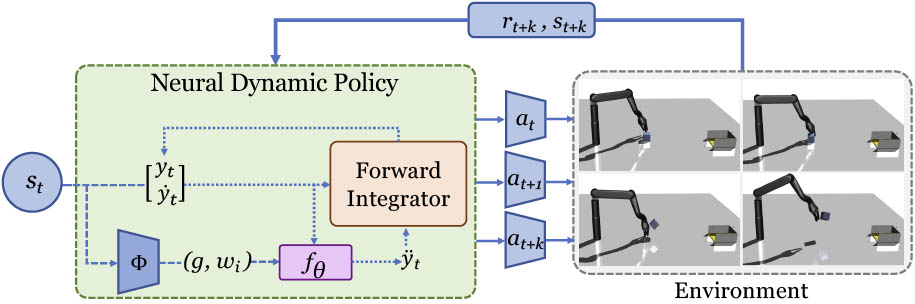

## Neural Dynamic Policies for End-to-End Sensorimotor Learning ##
#### In NeurIPS 2020 (Spotlight) [[Project Website]](http://shikharbahl.github.io/neural-dynamic-policies/) [[Project Video]](https://youtu.be/e2yN_8nhLYY)

[Shikhar Bahl](http://www.cs.cmu.edu/~sbahl2/), [Mustafa Mukadam](http://www.mustafamukadam.com/), [Abhinav Gupta](http://www.cs.cmu.edu/~abhinavg/), [Deepak Pathak](https://www.cs.cmu.edu/~dpathak/)<br/>
Carnegie Mellon University & Facebook AI Research <br/>



This is a [PyTorch](https://pytorch.org/) based implementation for our [NeurIPS 2020 paper on Neural Dynamic Policies for end-to-end sensorimotor learning](http://shikharbahl.github.io/neural-dynamic-policies/). In this work, we begin to close this gap and embed dynamics structure into deep neural network-based policies by reparameterizing action spaces with differential equations. We propose Neural Dynamic Policies (NDPs) that make predictions in trajectory distribution space as opposed to prior policy learning methods where action represents the raw control space. The embedded structure allow us to perform end-to-end policy learning under both reinforcement and imitation learning setups. If you find this work useful in your research, please cite:
```
  @inproceedings{bahl2020neural,
    Author = { Bahl, Shikhar and Mukadam, Mustafa and
    Gupta, Abhinav and Pathak, Deepak},
    Title = {Neural Dynamic Policies for End-to-End Sensorimotor Learning},
    Booktitle = {NeurIPS},
    Year = {2020}
  }
```

### 1) Installation and Usage
  1.  This code is based on [PyTorch](https://pytorch.org/). This code needs [MuJoCo 1.5](http://www.mujoco.org/) to run. To install and setup the code, run the following commands:
  ```Shell
  #create directory for data and add dependencies
  cd neural-dynamic-polices; mkdir data/
  git clone https://github.com/rll/rllab.git
  git clone https://github.com/openai/baselines.git

  #create virtual env
  conda create --name ndp python=3.5
  source activate ndp

  #install requirements
  pip install -r requirements.txt
  #OR try
  conda env create -f ndp.yaml
  ```


2. Training imitation learning
  ```Shell
  cd neural-dynamic-polices
  # name of the experiment
  python main_il.py --name NAME
  ```

3. Training RL: run the script `run_rl.sh`. `ENV_NAME` is the environment (could be `throw`, `pick`, `push`, `soccer`, `faucet`). `ALGO-TYPE` is the algorithm (`dmp` for NDPs, `ppo` for [PPO](https://arxiv.org/pdf/1707.06347.pdf) [Schulman et al., 2017] and `ppo-multi` for the multistep actor-critic architecture we present in our paper).
  ```Shell
  sh run_rl.sh ENV_NAME ALGO-TYPE EXP_ID SEED
```

4. In order to visualize trained models/policies, use the same exact arguments as used for training but call `vis_policy.sh`
```Shell
  sh vis_policy.sh ENV_NAME ALGO-TYPE EXP_ID SEED
```


### 2) Other helpful pointers
- [Paper](http://shikharbahl.github.io/neural-dynamic-policies/resources/neurips2020.pdf)
- [Project Website](http://shikharbahl.github.io/neural-dynamic-policies/)
- [Project Video](https://youtu.be/e2yN_8nhLYY)
<!-- - [Reddit Discussion](https://redd.it/6bc8ul) -->
<!-- - [Media Articles (New Scientist, MIT Tech Review and others)](http://pathak22.github.io/noreward-rl/index.html#media) -->

### 3) Acknowledgements
We use the PPO infrastructure from: https://github.com/ikostrikov/pytorch-a2c-ppo-acktr-gail. We use environment code from: https://github.com/dibyaghosh/dnc/tree/master/dnc/envs, https://github.com/rlworkgroup/metaworld, https://github.com/vitchyr/multiworld. We use pytorch and RL utility functions from: https://github.com/vitchyr/rlkit. We use the DMP skeleton code from https://github.com/abr-ijs/imednet, https://github.com/abr-ijs/digit_generator. We also use https://github.com/rll/rllab.git and https://github.com/openai/baselines.git.
